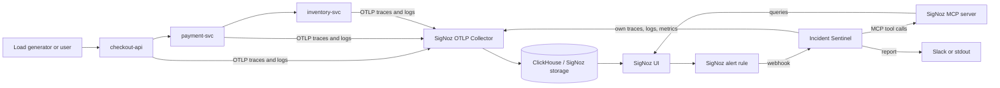
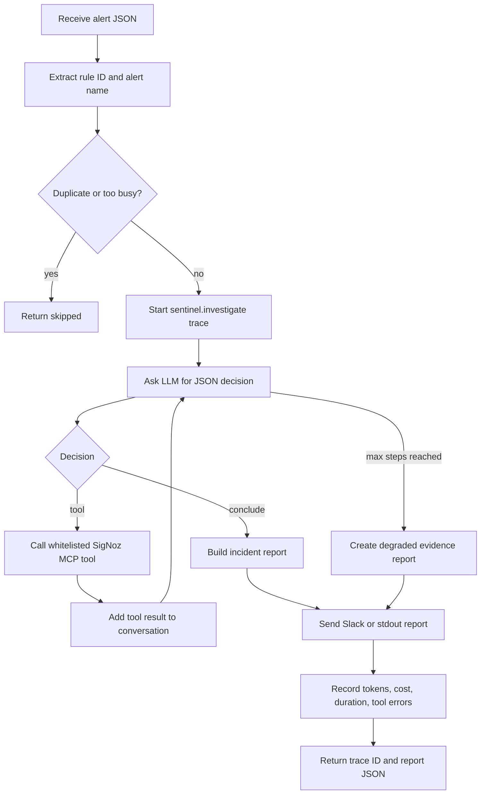
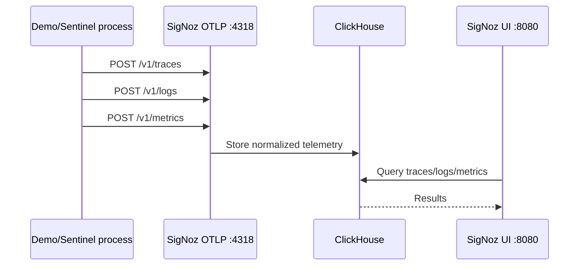
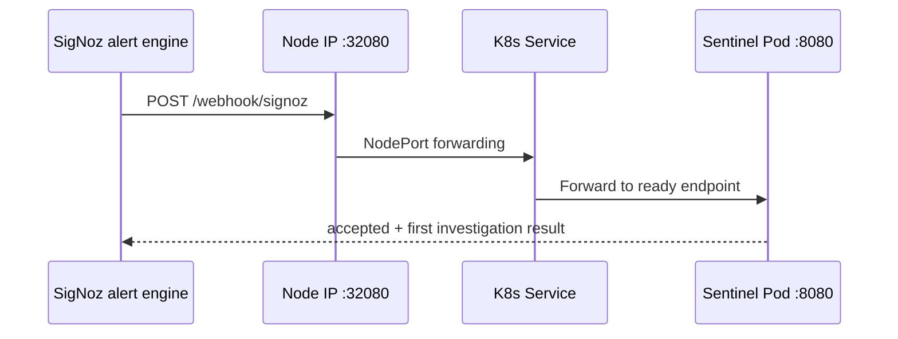
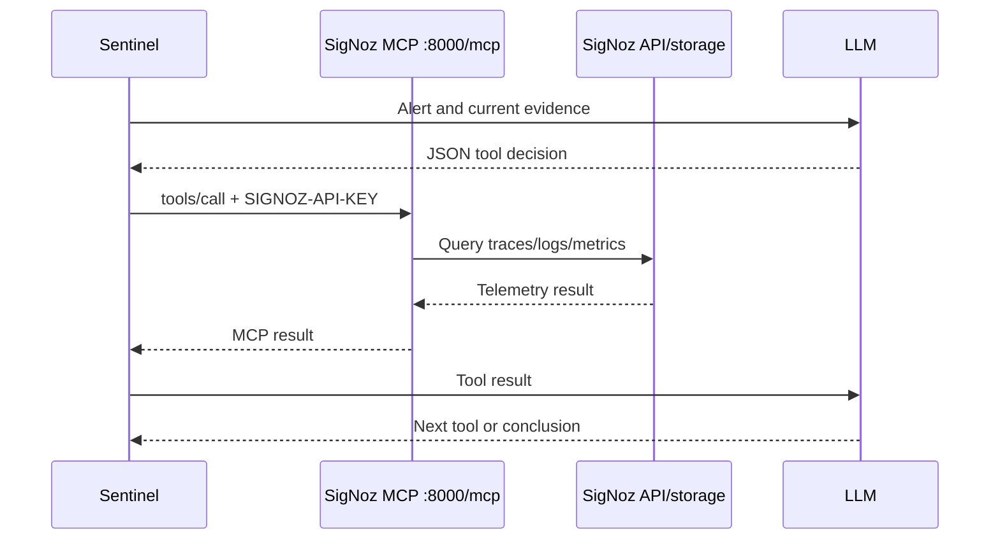
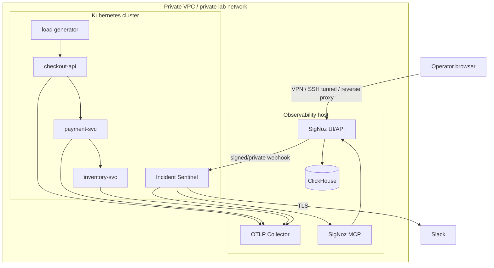

# Incident Sentinel — Project Understanding, Folder Structure, Networking, and Your Responsibilities

> This guide explains the uploaded `incident-sentinel-handoff` project in plain language, then maps every folder, network flow, port, execution path, unfinished item, and submission responsibility.
>
> Verified against the source archive and current official SigNoz, OpenTelemetry, Kubernetes, and hackathon documentation on **20 July 2026**.

---

## 1. The project in one sentence

**Incident Sentinel is an AI-assisted SRE incident investigator that receives a SigNoz alert, queries SigNoz for traces/logs/metrics through the SigNoz MCP server, produces a root-cause report, and sends telemetry about its own investigation back to SigNoz.**

It is therefore doing two forms of observability:

1. **Application observability** — observe the fake checkout microservices.
2. **Agent observability** — observe the Incident Sentinel AI agent itself.

This matches the hackathon's Track 01 theme: **AI & Agent Observability**, especially the suggested “SRE Sidekick with SigNoz MCP” idea.

---

## 2. What problem is it solving?

A normal alert says something like:

> `checkout-api error rate is high`

That tells an engineer **what is wrong**, but usually not:

- which downstream service caused it;
- which trace contains the failure;
- which logs correspond to that trace;
- whether latency or errors started first;
- what action should be taken;
- how much the AI investigation cost;
- whether the investigator itself failed or became slow.

Incident Sentinel tries to automate the first investigation pass:

```text
Alert → collect evidence → correlate telemetry → propose root cause → report
```

It does **not currently repair the system automatically**. It is an investigation and reporting copilot, not a self-healing controller.

---

## 3. The simplest mental model

Think of the project as four systems:

| System | Purpose |
|---|---|
| Demo shop | Produces realistic errors, latency, traces, and logs |
| SigNoz | Stores and visualizes telemetry; evaluates alerts |
| SigNoz MCP server | Gives the agent tool-based access to SigNoz data |
| Incident Sentinel | Runs the investigation loop and writes the report |



---

## 4. What the uploaded top-level folder means

```text
incident-sentinel-handoff/
├── START-HERE.md
├── STEP-BY-STEP.md
├── REMAINING-STEPS.md
├── HOW-IT-WORKS.md
└── project/
```

This is a **handoff pack**. It contains both the real project and documentation for another person to continue it.

| File | Meaning |
|---|---|
| `START-HERE.md` | Reading order and one-paragraph project summary |
| `STEP-BY-STEP.md` | Deployment instructions for a new server |
| `REMAINING-STEPS.md` | Work still needed before hackathon submission |
| `HOW-IT-WORKS.md` | Short architecture and Python agent-loop explanation |
| `project/` | Actual source, Kubernetes YAML, Foundry configuration, specs, and submission material |

Your working directory should normally be:

```bash
cd incident-sentinel-handoff/project
```

---

# 5. Complete `project/` folder structure

```text
project/
├── .env.example
├── .gitignore
├── LICENSE
├── README.md
├── IMPLEMENT-README.md
│
├── foundry/
│   ├── casting.yaml
│   └── casting.yaml.lock
│
├── demo/
│   ├── demo-app.yaml
│   ├── break.sh
│   └── k8s-infra-values.yaml
│
├── copilot/
│   ├── Dockerfile
│   ├── requirements.txt
│   ├── k8s.yaml
│   ├── app/
│   │   ├── __init__.py
│   │   ├── config.py
│   │   ├── main.py
│   │   ├── investigator.py
│   │   ├── mcp_client.py
│   │   ├── llm.py
│   │   ├── telemetry.py
│   │   └── report.py
│   └── kagent/
│       ├── README.md
│       └── placeholder.yaml
│
├── scripts/
│   ├── deploy-k8s.sh
│   └── refresh-api-key.sh
│
├── alerts/
│   ├── README.md
│   ├── checkout-error-spike.json
│   └── sentinel-cost-budget.json
│
├── dashboards/
│   ├── incident-overview.json
│   └── copilot-operations.json
│
├── blog/
│   └── hackathon-blog-draft.md
│
└── docs/
    ├── ARCHITECTURE.md
    ├── CONTEXT.md
    ├── DECISIONS.md
    ├── DEMO-VIDEO.md
    ├── FOUNDRY-NOTES.md
    ├── IMPLEMENTATION-GUIDE.md
    ├── PLAN.md
    ├── PREP-CHECKLIST.md
    ├── REPORT-FORMAT.md
    ├── RULES-COMPLIANCE.md
    └── SUBMISSION.md
```

---

# 6. What every main folder does

## 6.1 `foundry/` — installs SigNoz and MCP

### `foundry/casting.yaml`

This is the human-written desired state:

```yaml
apiVersion: v1alpha1
kind: Installation
metadata:
  name: signoz
spec:
  deployment:
    flavor: compose
    mode: docker
  mcp:
    spec:
      enabled: true
```

Meaning:

- deploy SigNoz using Docker Compose;
- enable the SigNoz MCP server;
- let `foundryctl` generate and run the stack.

Typical command:

```bash
foundryctl cast -f foundry/casting.yaml
```

### `foundry/casting.yaml.lock`

This is generated by Foundry. It records the expanded installation state used to reproduce the environment.

The hackathon explicitly requires both files in the public repository.

### Important current problem

The lock file records:

```text
clickhouse/clickhouse-keeper:25.12.5
```

But the handoff documentation says that image crashed on the original host and the generated Compose file was manually changed to:

```text
clickhouse/clickhouse-keeper:24.8.14
```

This means **the current repository does not fully reproduce the working installation**. Re-running Foundry may bring back the version that previously failed.

Also, several lock-file components use `latest`, which weakens repeatability:

- `signoz/signoz:latest`
- `signoz/signoz-otel-collector:latest`
- `signoz/signoz-mcp-server:latest`

### What you should do

Before submission:

1. test a clean Foundry deployment from only `casting.yaml` and the lock;
2. use supported component image overrides in `casting.yaml` where needed;
3. regenerate `casting.yaml.lock` through Foundry;
4. do not rely on an undocumented manual edit under `pours/deployment/`;
5. confirm all long-running containers are healthy after a clean rebuild.

---

## 6.2 `demo/` — creates the intentionally broken application

### `demo/demo-app.yaml`

This Kubernetes manifest creates:

- one ConfigMap containing a Python FastAPI application;
- `inventory-svc` Deployment and Service;
- `payment-svc` Deployment and Service;
- `checkout-api` Deployment and Service;
- one CronJob named `checkout-loadgen`.

The request path is:

```text
checkout-api:8000/checkout
        ↓
payment-svc:8000/payment
        ↓
inventory-svc:8000/inventory
```

Each service:

- creates OpenTelemetry spans;
- emits application logs;
- exports OTLP/HTTP data to the SigNoz host on port `4318`;
- can inject random errors and artificial latency.

### `demo/break.sh`

This changes environment variables on the running Kubernetes Deployments:

```bash
./demo/break.sh errors
./demo/break.sh latency
./demo/break.sh inventory-errors
./demo/break.sh heal
```

It uses:

```bash
kubectl set env deployment/<name> ...
```

Changing the Deployment pod template causes Kubernetes to roll out replacement Pods with the new fault settings.

### `demo/k8s-infra-values.yaml`

This is optional Helm configuration for SigNoz's Kubernetes infrastructure monitoring chart. It can send cluster-level telemetry to the same SigNoz OTLP endpoint.

It is currently hard-coded to the original host IP and must be changed.

---

## 6.3 `copilot/` — the real Incident Sentinel application

This is a Python FastAPI service.

### `copilot/app/config.py`

Reads configuration from environment variables:

| Variable | Purpose |
|---|---|
| `SIGNOZ_URL` | SigNoz UI/API base URL |
| `MCP_URL` | SigNoz MCP HTTP endpoint |
| `SIGNOZ_API_KEY` | Service-account key used for MCP/SigNoz access |
| `OTEL_EXPORTER_OTLP_ENDPOINT` | Where Sentinel sends its own telemetry |
| `LLM_PROVIDER` | `mock`, `openai`, `anthropic`, or `groq` |
| `LLM_API_KEY` | Real LLM provider key |
| `LLM_MODEL` | Model name |
| `SLACK_WEBHOOK_URL` | Optional report destination |
| `SENTINEL_MAX_STEPS` | Maximum agent reasoning/tool loop iterations |
| `SENTINEL_DEDUPE_SECONDS` | Duplicate-alert suppression period |
| `SENTINEL_MAX_CONCURRENT` | Max simultaneous investigations |

### `copilot/app/main.py`

Provides three HTTP entry points:

| Method and path | Purpose |
|---|---|
| `GET /healthz` | Kubernetes readiness and manual health check |
| `POST /webhook/signoz` | Receives a SigNoz alert webhook |
| `POST /investigate` | Manually triggers an investigation for demo/testing |

### `copilot/app/investigator.py`

This is the main agent state machine:



Whitelisted tools include:

- `signoz_list_alerts`
- `signoz_get_alert_history`
- `signoz_list_services`
- `signoz_search_traces`
- `signoz_get_trace_details`
- `signoz_search_logs`
- `signoz_query_metrics`

The whitelist is a good safety boundary: the LLM cannot ask Python to call an arbitrary function.

### `copilot/app/mcp_client.py`

Builds a JSON-RPC style request:

```json
{
  "jsonrpc": "2.0",
  "id": 1,
  "method": "tools/call",
  "params": {
    "name": "signoz_search_traces",
    "arguments": {
      "hasError": true
    }
  }
}
```

It sends this over HTTP to:

```text
http://<signoz-host>:8000/mcp
```

It supports both normal JSON and server-sent event responses.

### `copilot/app/llm.py`

Supports:

- OpenAI-compatible APIs;
- Groq through an OpenAI-compatible endpoint;
- Anthropic Messages API;
- deterministic mock mode.

### Critical mock-mode limitation

`LLM_PROVIDER=mock` is not a genuine AI diagnosis. It always follows this fixed sequence:

1. search error traces;
2. search logs containing `failed`;
3. return a hard-coded conclusion saying payment/checkout error rates caused the problem.

The MCP calls can retrieve real data, but the final conclusion is predetermined and does not inspect the tool result deeply.

For a credible competition demo, either:

- use a real LLM provider; or
- rewrite mock mode into a deterministic evidence-based rules engine that calculates its conclusion from returned telemetry.

Do not present the current mock conclusion as autonomous reasoning.

### `copilot/app/telemetry.py`

Creates OpenTelemetry exporters for:

- traces → `/v1/traces`;
- metrics → `/v1/metrics`;
- logs → `/v1/logs`.

It records agent-specific telemetry including:

- `sentinel.investigate` spans;
- `sentinel.step` spans;
- `sentinel.tool` spans;
- `gen_ai.chat` spans;
- token counters;
- estimated USD cost;
- investigation duration;
- MCP tool errors.

This self-observability is the strongest part of the project.

### `copilot/app/report.py`

Creates Slack Block Kit-style report blocks. When Slack is not configured, it logs the same structure to stdout.

### `copilot/Dockerfile`

Builds a conventional Python container image and is the proper long-term deployment path.

### `copilot/k8s.yaml`

A handwritten quick-demo manifest. The actual deploy script currently generates a different Deployment dynamically.

### `copilot/kagent/`

Only a placeholder/stretch direction. It is not part of the working core.

---

## 6.4 `scripts/` — deployment helpers

### `scripts/deploy-k8s.sh`

This script:

1. requires `FOUNDRY_HOST`;
2. creates namespace `foundry` if missing;
3. replaces `OTLP_HOST_PLACEHOLDER` in YAML;
4. deploys the demo services;
5. converts the copilot source tree into a ConfigMap;
6. creates a Secret from shell environment values;
7. generates and applies a copilot Deployment;
8. exposes Sentinel as NodePort `32080`.

This is convenient for a hackathon, but not a good production deployment because the pod installs Python packages every time it starts and runs source from ConfigMaps instead of a versioned image.

### `scripts/refresh-api-key.sh`

Logs into SigNoz using email/password, extracts a short-lived access token, updates the Kubernetes Secret, and restarts Sentinel.

The preferred final setup is a long-lived **SigNoz Service Account API key**, not repeated login-token refresh.

---

## 6.5 `alerts/` — intended alert definitions

These files describe:

- `checkout-error-spike`;
- `payment-latency-spike`;
- `sentinel-cost-budget`.

Important: the JSON files are **design specifications**, not guaranteed directly importable alert exports. The repository itself says exact fields vary by SigNoz version.

You must create and test the real alert rules in the live SigNoz UI/API, attach the webhook channel, then export or document the actual final configuration.

---

## 6.6 `dashboards/` — intended dashboard layouts

These files are also **specifications**, not real exported SigNoz dashboards.

Planned dashboards:

### Incident Overview

- checkout error spans;
- payment p99 latency;
- inventory errors;
- RED overview.

### Copilot Operations

- input/output tokens;
- estimated investigation cost;
- investigation duration;
- MCP tool errors;
- Sentinel investigation traces.

You are expected to recreate these panels in SigNoz Query Builder and export the real dashboard JSON.

---

## 6.7 `blog/` and `docs/` — presentation and handoff material

These explain:

- architecture;
- decisions;
- rules compliance;
- final demo video;
- final submission;
- human-only steps;
- environment-specific problems encountered on the original host.

The docs are useful, but several contain stale private IPs, hostnames, local paths, and old environment assumptions. Replace those with variables or diagrams before publishing.

---

# 7. Networking architecture in depth

## 7.1 Two network zones

The project can be deployed in two ways:

### Original intended layout

```text
Host A: Docker / Foundry / SigNoz / MCP
Host B: Kubernetes demo + Incident Sentinel
```

### Layout that reportedly worked in the handoff

```text
One machine:
- Docker runs Foundry SigNoz + MCP
- Kubernetes on the same host runs demo + Sentinel
```

The second layout was used because the separate Kubernetes cluster could not reach the Foundry host reliably.

---

## 7.2 Required port map

| Port | Protocol | Listener | Caller | Purpose | Public exposure? |
|---:|---|---|---|---|---|
| `8080` | TCP/HTTP | SigNoz | Browser, Sentinel links/API | SigNoz UI/API | Prefer private/VPN or authenticated reverse proxy |
| `4317` | TCP/gRPC | SigNoz OTLP collector | OTel gRPC clients | OTLP/gRPC ingestion | Private only unless TLS/auth added |
| `4318` | TCP/HTTP | SigNoz OTLP collector | Demo services, Sentinel | OTLP/HTTP telemetry ingestion | Private only unless TLS/auth added |
| `8000` | TCP/HTTP | SigNoz MCP server | Incident Sentinel | MCP JSON-RPC tool calls | Private only |
| `32080` | TCP/HTTP | Kubernetes NodePort | SigNoz webhook sender/operator | Sentinel webhook/manual API | Restrict to SigNoz host/operator network |
| `8000` | TCP/HTTP | Demo Kubernetes Services | Other demo pods | Internal checkout/payment/inventory calls | Cluster-internal only |
| `8080` | TCP/HTTP | Sentinel container | K8s Service | Sentinel API | Internal through Service; external via NodePort |

Do not confuse the repeated ports:

- SigNoz MCP uses host port `8000`.
- Demo microservices also use port `8000`, but only through separate Kubernetes Service IPs/DNS names.
- Sentinel container uses port `8080`.
- Sentinel externally uses NodePort `32080`.

---

## 7.3 Kubernetes internal service networking

```mermaid
flowchart LR
    LG[checkout-loadgen CronJob Pod]
    CS[checkout-api Service ClusterIP:8000]
    CP[checkout-api Pod:8000]
    PS[payment-svc Service ClusterIP:8000]
    PP[payment-svc Pod:8000]
    IS[inventory-svc Service ClusterIP:8000]
    IP[inventory-svc Pod:8000]

    LG -->|HTTP GET /checkout| CS
    CS --> CP
    CP -->|DNS payment-svc, HTTP /payment| PS
    PS --> PP
    PP -->|DNS inventory-svc, HTTP /inventory| IS
    IS --> IP
```



Kubernetes DNS resolves names such as:

```text
payment-svc
inventory-svc
checkout-api
```

within namespace `foundry`.

A `ClusterIP` Service is only reachable inside the cluster. A `NodePort` opens the chosen port on each Kubernetes node and forwards traffic to ready Sentinel Pods.

---

## 7.4 Telemetry flow

Every service uses OTLP over HTTP:

```text
Pod
  └─ TCP connection to <FOUNDRY_HOST>:4318
       ├─ POST /v1/traces
       ├─ POST /v1/logs
       └─ POST /v1/metrics   (Sentinel)
```

OpenTelemetry serializes telemetry using OTLP protobuf over HTTP.



---

## 7.5 Alert-to-agent flow



The webhook endpoint currently has no signature validation or authentication. Restrict it by firewall/source network, or add a shared-secret header.

---

## 7.6 MCP investigation flow



MCP does not store the telemetry. It is a controlled tool interface over SigNoz data.

---

# 8. OSI-model view

| Layer | What occurs in this project |
|---|---|
| Layer 7 — Application | HTTP, FastAPI routes, JSON-RPC MCP, OTLP/HTTP, Slack webhook |
| Layer 6 — Presentation | JSON for alerts/reports/MCP control; protobuf for OTLP payloads |
| Layer 5 — Session | HTTP keep-alive/request sessions; MCP HTTP/SSE response handling |
| Layer 4 — Transport | TCP connections to `8080`, `4318`, `8000`, `32080` |
| Layer 3 — Network | Kubernetes Pod IPs, Service IPs, node IP, Foundry host IP, routing/security groups |
| Layer 2 — Data Link | VM NIC, bridge/CNI interfaces, Docker bridge, Ethernet frames |
| Layer 1 — Physical | Cloud virtual network or physical host networking |

This project does not use UDP for its main application/observability flows.

---

# 9. End-to-end incident example

Assume you run:

```bash
./demo/break.sh inventory-errors
```

Then:

1. Kubernetes restarts `inventory-svc` with `ERROR_RATE=0.6`.
2. The load generator calls `checkout-api`.
3. Checkout calls payment.
4. Payment calls inventory.
5. Inventory may raise an injected error.
6. Payment receives an HTTP failure.
7. Checkout catches the downstream failure and returns HTTP `502`.
8. OpenTelemetry exports spans and logs to SigNoz.
9. SigNoz sees error spans and evaluates an alert rule.
10. The notification channel sends alert JSON to `node-ip:32080/webhook/signoz`.
11. Sentinel starts a `sentinel.investigate` span.
12. The LLM asks to search traces.
13. Sentinel calls `signoz_search_traces` through MCP.
14. The LLM may ask for matching logs or trace details.
15. Sentinel creates a root-cause report.
16. Report goes to Slack or stdout.
17. Sentinel sends its own spans, token metrics, cost metrics, logs, and duration to SigNoz.
18. You show both the broken app trace and the investigator trace in the same SigNoz UI.

That final “watch the watcher” step is the main hackathon story.

---

# 10. What is already done versus what you must do

## Already present in the archive

- Foundry configuration files;
- a generated Foundry lock file;
- demo microservice source and Kubernetes resources;
- fault-injection script;
- Incident Sentinel Python agent;
- MCP client;
- OpenTelemetry instrumentation;
- Slack/stdout report rendering;
- deployment helper scripts;
- alert/dashboard design specs;
- blog draft;
- video and submission notes.

## Still expected from you

### Priority 0 — compliance and ownership

1. Confirm you are allowed to use and submit this handoff code.
2. Declare all AI-assistant use.
3. Do not fabricate or alter commit dates.
4. Resolve the repository's date contradiction described below.

### Priority 1 — make the deployment reproducible

1. Replace all original IPs and hostnames.
2. Test a clean Foundry cast.
3. Resolve the Keeper version mismatch.
4. Pin important image/dependency versions.
5. build and deploy the Sentinel Docker image instead of pip-installing at pod startup.
6. prove a second person can follow the README successfully.

### Priority 2 — make the real alert path work

1. Create a SigNoz Service Account API key.
2. Store it in `incident-sentinel-secrets`.
3. Create the webhook notification channel.
4. Secure the webhook with source restriction or a secret.
5. Create the real alert rule.
6. fire the alert using fault injection.
7. confirm Sentinel starts without manually calling `/investigate`.

### Priority 3 — make the investigation credible

1. Use a real LLM or evidence-based deterministic logic.
2. show the MCP queries and returned evidence.
3. include trace/log deep links in the report.
4. test wrong hypotheses and tool errors.
5. show degraded operation when the LLM is unavailable.

### Priority 4 — complete observability assets

1. build both dashboards in SigNoz;
2. export actual dashboard JSON;
3. create and test the cost-budget alert;
4. verify all Sentinel metrics appear;
5. optionally add Kubernetes infrastructure telemetry.

### Priority 5 — submission

1. public GitHub repository;
2. polished README;
3. two-to-three-minute demo video;
4. published blog;
5. submission form;
6. AI-use declaration;
7. optional social posts.

---

# 11. Important problems I found in the current project

## 11.1 Rules/date contradiction — resolve before submission

The hackathon rule says coding and design work should begin only after the event starts.

However, repository documents say:

- the custom Python agent was selected on 13 July;
- Foundry was completed on 17 July;
- demo and copilot were live on 17 July;
- end-to-end investigation was verified on 17 July;
- the README calls the code and deployment already complete.

At the same time, `RULES-COMPLIANCE.md` says copilot code, demo code, dashboards, and alert definitions should not exist before 20 July.

These statements conflict.

Do not hide the conflict. Ask the organizer whether this handoff may be used, clearly identify what was pre-existing, and submit only in a compliant manner.

## 11.2 Foundry lock does not describe the manual working fix

The lock says Keeper `25.12.5`; handoff notes say the working generated Compose was manually changed to `24.8.14`.

That is not a reproducible infrastructure-as-code path.

## 11.3 `latest` image tags

Several Foundry components use `latest`. A judge running the same repo later may obtain different software.

## 11.4 Mock mode is a scripted demo

The final root-cause conclusion is hard-coded. It does not prove agent intelligence.

## 11.5 Load generation may be too weak for the alert threshold

The CronJob sends only one checkout request per minute. The proposed alert requires more than three error spans in five minutes. With a 50% checkout error probability, four or more failed requests out of five occurs only occasionally.

For a reliable demo, use one of these:

- set the relevant error rate to `1.0`;
- generate several requests per CronJob execution;
- run a short continuous load generator;
- lower the threshold for the demo.

Then restore a realistic rule afterward.

## 11.6 Unsecured external endpoints

`/webhook/signoz` and `/investigate` are reachable through NodePort and have no application authentication.

A caller could trigger expensive investigations repeatedly.

## 11.7 Plain HTTP between components

OTLP, MCP, SigNoz UI/API, and webhook traffic use plain HTTP. This is acceptable only on a protected lab/private network.

## 11.8 Secrets are written into temporary YAML

`deploy-k8s.sh` expands API keys/webhooks into a generated file under a temporary directory and does not remove that directory with a cleanup trap.

Prefer:

- pre-created Kubernetes Secrets;
- sealed secrets or an external secrets manager;
- no secret values in generated manifests or shell history.

## 11.9 Runtime dependency installation

Every demo/Sentinel pod runs `pip install` on startup. This causes:

- slow restarts;
- dependency drift;
- dependency on internet access;
- weaker reproducibility;
- supply-chain risk.

Build immutable images with pinned dependencies.

## 11.10 Dashboard and alert JSON are placeholders

They document intent but are not proven live exports.

## 11.11 In-memory state only

Deduplication and concurrency counters are process-local:

- they reset after restart;
- they do not work correctly across replicas;
- they are not protected by a distributed lock.

One replica is acceptable for the demo; production would need Redis/PostgreSQL or another shared store.

## 11.12 No webhook retry queue

If Sentinel crashes or the LLM/MCP times out, there is no durable message queue. A production version should decouple alert receipt from investigation execution.

---

# 12. What “done” should look like

The project is technically complete only when this full path works without manual shortcuts:

```text
break.sh
  → real telemetry in SigNoz
  → real alert fires
  → webhook reaches Sentinel
  → Sentinel queries real traces/logs/metrics through MCP
  → evidence-based report appears
  → Sentinel's own trace and metrics appear in SigNoz
  → dashboards and cost alert show the investigation
```

Submission-ready means:

- clone on a clean machine;
- deploy from documented commands;
- no stale private IPs;
- no committed secrets;
- Foundry recreates a healthy stack;
- actual alert-to-webhook path works;
- actual exported dashboards are in the repo;
- video demonstrates the live path;
- blog explains the problem, architecture, telemetry, and limitations;
- rules/AI use are disclosed honestly.

---

# 13. Recommended clean target architecture

For a strong hackathon demo while remaining simple:



Recommended boundaries:

- keep `4317`, `4318`, and `8000` private;
- expose SigNoz UI only through VPN, SSH tunnel, or authenticated TLS proxy;
- allow NodePort/webhook only from the SigNoz host;
- build versioned images;
- use Service Account API keys;
- add webhook authentication;
- use real DNS names instead of hard-coded private IPs.

---

# 14. Commands that prove each network path

Replace values first:

```bash
export FOUNDRY_HOST=<private-ip-or-dns>
export NS=foundry
```

## SigNoz UI/API

```bash
curl -fsS "http://${FOUNDRY_HOST}:8080/api/v1/health"
```

## MCP server

```bash
curl -fsS "http://${FOUNDRY_HOST}:8000/livez"
```

## OTLP TCP reachability

```bash
nc -vz "${FOUNDRY_HOST}" 4318
nc -vz "${FOUNDRY_HOST}" 4317
```

## Kubernetes service discovery

```bash
kubectl -n "$NS" get pods -o wide
kubectl -n "$NS" get svc
kubectl -n "$NS" get endpoints
```

## Internal demo request

```bash
kubectl -n "$NS" run curl-test --rm -it --restart=Never \
  --image=curlimages/curl:8.5.0 -- \
  curl -sv http://checkout-api:8000/checkout
```

## Sentinel internal API

```bash
SVC_IP=$(kubectl -n "$NS" get svc incident-sentinel -o jsonpath='{.spec.clusterIP}')
curl -fsS "http://${SVC_IP}:8080/healthz"
```

## Sentinel logs

```bash
kubectl -n "$NS" logs deploy/incident-sentinel -f
```

## Verify configured endpoints inside Sentinel

```bash
kubectl -n "$NS" exec deploy/incident-sentinel -- env | \
  grep -E 'SIGNOZ_URL|MCP_URL|OTEL_EXPORTER_OTLP_ENDPOINT|LLM_PROVIDER'
```

## Test fault path

```bash
./demo/break.sh errors
kubectl -n "$NS" rollout status deploy/checkout-api
kubectl -n "$NS" rollout status deploy/payment-svc
```

---

# 15. Suggested order for you to work

```text
1. Read this file
2. Replace stale IPs and names
3. Verify rule compliance and code ownership
4. Clean-test Foundry reproduction
5. Build versioned demo and Sentinel images
6. Deploy Kubernetes resources
7. Verify OTLP ingestion
8. Create Service Account API key
9. Verify MCP calls
10. Create and secure webhook channel
11. Create real alert and force it to fire
12. Replace mock diagnosis or use a real LLM
13. Build/export dashboards
14. Create cost meta-alert
15. Record demo
16. publish blog
17. push public repo and submit
```

---

# 16. What judges should understand in 30 seconds

Use this explanation:

> Incident Sentinel is an observable SRE copilot. A deliberately faulty checkout application sends OpenTelemetry traces and logs to SigNoz. When SigNoz detects an error spike, it calls Sentinel. Sentinel uses the SigNoz MCP server to investigate the same telemetry, generates an evidence-backed incident report, and exports its own LLM steps, MCP tool calls, token usage, cost, latency, and failures back to SigNoz. This lets an operator inspect both the production incident and the AI that investigated it from one platform.

---

# 17. Official references

- Hackathon overview: <https://www.wemakedevs.org/hackathons/signoz>
- Hackathon rules: <https://www.wemakedevs.org/hackathons/signoz/rules>
- SigNoz Docker/Foundry installation: <https://signoz.io/docs/install/docker/>
- SigNoz MCP server: <https://signoz.io/docs/ai/signoz-mcp-server/>
- OpenTelemetry OTLP exporter configuration: <https://opentelemetry.io/docs/languages/sdk-configuration/otlp-exporter/>
- Kubernetes Services and NodePort: <https://kubernetes.io/docs/concepts/services-networking/service/>

---

## Final assessment

The project has a strong and relevant core idea. Its best technical feature is **self-observability of the incident investigator**. The code structure is small enough to explain in a demo, and the MCP tool whitelist is a sensible control boundary.

However, the current handoff is **not yet submission-ready**. The main blockers are:

1. rules/date and ownership clarification;
2. reproducible Foundry configuration;
3. real alert-to-webhook completion;
4. real exported dashboards;
5. credible evidence-based diagnosis instead of a hard-coded mock conclusion;
6. removal of stale environment-specific values;
7. basic network and secret hardening.

