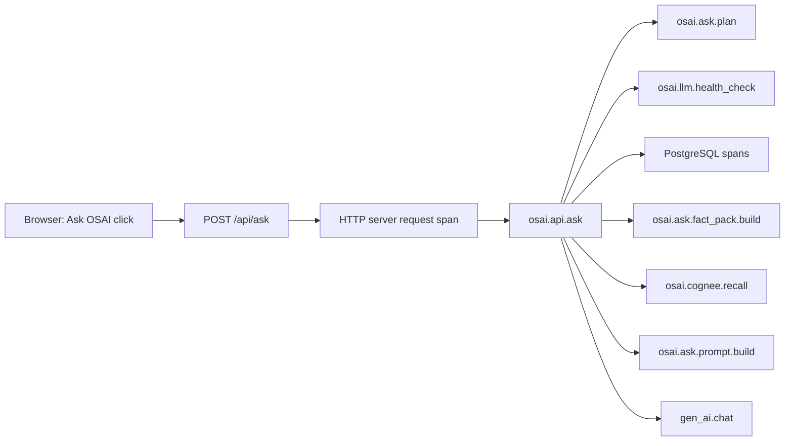
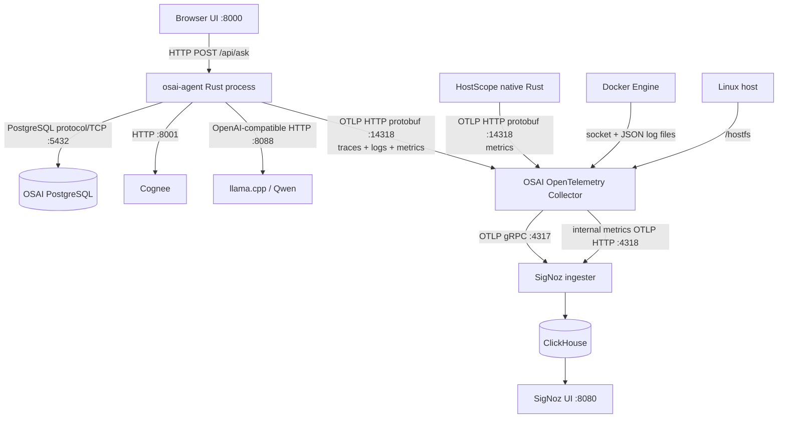
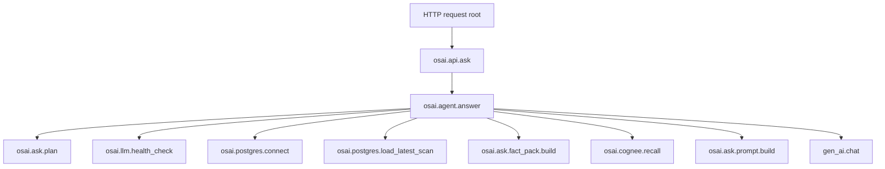

# OSAI Observability Beginner Guide

This standalone guide combines the two authoritative package documents:

1. `docs/10-OBSERVABILITY-FROM-ZERO.md`
2. `docs/11-ASK-OSAI-ONE-REQUEST-JOURNEY.md`

---

# Observability from Zero: OSAI, HostScope, OpenTelemetry, and SigNoz

This document defines one standardized telemetry model for OSAI. Read it before creating dashboards or alerts.

## 1. What instrumentation means

Instrumentation is code or configuration that records what a system is doing in a structured form.

Without instrumentation, OSAI may work, but SigNoz cannot answer:

- Which request was slow?
- Did PostgreSQL, Cognee, or Qwen cause the delay?
- Did the request fail, or did OSAI use a fallback?
- What logs belong to the same request?
- How often are Ask OSAI requests happening?

Instrumentation creates three primary signals:

| Signal | Mental model | OSAI example |
|---|---|---|
| Trace | One journey | One click on **Ask OSAI** through Rust, PostgreSQL, Cognee, and Qwen |
| Log | One event/message | `Cognee recall failed` or `Ask OSAI request completed` |
| Metric | A number measured across many events | Ask request count, duration histogram, CPU utilization |

A trace is a tree. The complete tree is the trace; each timed operation inside it is a span.



## 2. Signal ownership: who sends what

Every signal must have one owner. This avoids duplicates and contradictory service names.

| Owner | Sends | Does not own |
|---|---|---|
| `osai-agent` | Application traces, correlated application logs, Ask OSAI application metrics | Host CPU/disk metrics, Docker stdout logs |
| HostScope | Host-specific metrics and redacted host-context change events | Web request traces, Qwen spans, container logs |
| Collector `hostmetrics` | Standard host CPU, memory, disk, filesystem, network, paging, process-count metrics | Ask OSAI internals |
| Collector `docker_stats` | Container CPU, memory, network, block-I/O metrics | Rust application spans |
| Collector `filelog/docker` | Docker container stdout/stderr | Native systemd application logs |
| OSAI Collector | Receives, detects resources, samples traces, batches, retries, and forwards all signals | Business reasoning |
| SigNoz | Stores, queries, correlates, visualizes, and alerts | Instrumenting uninstrumented code |

### Stable service names

| `service.name` | Meaning |
|---|---|
| `osai-agent` | Rust dashboard/API and Ask OSAI application |
| `hostscope-agent` | HostScope metrics |
| `hostscope-context` | Change-only redacted host-context logs |
| `osai-host` | Standard Collector hostmetrics |
| `osai-docker-stack` | Docker metrics and container logs |
| `osai-signoz-collection-agent` | Collector self-health metrics (`otelcol_*`) |

## 3. Communication path



The OSAI application does not send directly to ClickHouse. It sends OpenTelemetry data to the local Collector. The Collector is the controlled gateway.

## Runtime dependency policy

This upgrade adds no Python process, sidecar, temporary telemetry container, or frontend telemetry package. It reuses the existing Rust binaries, the existing OSAI OpenTelemetry Collector, and the existing SigNoz ingestion ports. The browser uses its built-in `crypto.randomUUID()` only to create a request ID.

## 4. What changed in v2.2.5

### Before

- OSAI exported traces only.
- OSAI logs went to journald, then a second service copied them into a file.
- Those logs did not reliably carry standard OpenTelemetry `trace_id` and `span_id` fields.
- OSAI had no custom Ask metrics.
- The UI did not reveal the trace ID for a specific answer.
- Trace View could be confusing because the HTTP middleware root span and the `osai.api.ask` child span were different rows/views.

### Now

- OSAI exports traces, logs, and application metrics directly over OTLP/HTTP.
- The official `tracing` to OpenTelemetry log bridge attaches trace context to logs.
- The duplicate `osai-journal-export.service` ingestion path is removed.
- Journald remains available locally for operators through `journalctl`.
- Ask OSAI returns an `observability` proof object.
- The browser displays the exact Trace ID and exact SigNoz filters.
- Qwen token counts, model, finish reason, and timing fields are recorded when llama.cpp returns them.
- The Collector sends its own `otelcol_*` health metrics to SigNoz.

## 5. Privacy and cardinality rules

The following are safe to attach to spans/logs:

- request ID and trace ID;
- question length, prompt length, answer length;
- AI requested/used booleans;
- component status and duration;
- model name, token counts, finish reason;
- service, environment, host, and version.

The following are intentionally not exported by default:

- full user question;
- full constructed prompt;
- full Qwen completion;
- recalled Cognee memory;
- API keys, bearer tokens, cookies, or credentials.

Request IDs and Trace IDs belong in traces/logs, not as metric labels. Putting unique IDs in metrics creates unbounded cardinality.

## 6. Why HostScope is still needed

HostScope answers a different class of question:

> What is the state of the machine?

It reports host facts and metrics such as CPU count, memory, filesystems, network counters, load average, process count, and collection issues. It also keeps a full redacted snapshot locally and sends a compact event only when important context changes.

OSAI application instrumentation answers:

> What happened during this specific request?

Neither replaces the other.

## 7. Official references

- SigNoz Rust OpenTelemetry instrumentation: https://signoz.io/docs/instrumentation/opentelemetry-rust/
- SigNoz Docker collection agent: https://signoz.io/docs/opentelemetry-collection-agents/docker/overview/
- SigNoz host metrics: https://signoz.io/docs/infrastructure-monitoring/hostmetrics/
- SigNoz Collector self-telemetry: https://signoz.io/docs/metrics-management/opentelemetry-collector-metrics/
- OpenTelemetry OTLP specification: https://opentelemetry.io/docs/specs/otlp/
- OpenTelemetry tracing log bridge: https://docs.rs/opentelemetry-appender-tracing/0.32.0/opentelemetry_appender_tracing/
- OpenTelemetry GenAI semantic conventions: https://opentelemetry.io/docs/specs/semconv/gen-ai/


---

# One Ask OSAI Request: Trace, Logs, and Metrics

This is the first observability exercise. Do not create a dashboard until this request is visible end to end.

## 1. Upgrade the running installation

From the extracted v2.2.5 package:

```bash
sudo ./START-HERE.sh observability-upgrade
```

This preserves Docker volumes, Qwen model files, OSAI environment files, and existing SigNoz data.

Confirm:

```bash
sudo systemctl status osai-agent.service --no-pager
curl -fsS http://127.0.0.1:8000/api/health
curl -fsS http://127.0.0.1:13133/
```

## 1.1 Validate before the first request

```bash
sudo ./scripts/validate-standardized-observability.sh
```

This compiles the Rust application, renders the existing Compose configuration, and asks the already-declared Collector image to validate its configuration. It does not install Python or create a persistent new container.

## 2. Generate one real request

Open:

```text
http://127.0.0.1:8000
```

1. Find **Ask OSAI**.
2. Click **AI off** so it becomes **AI requested**.
3. Ask:

```text
Show current CPU and memory usage. Explain whether either is unhealthy and give safe read-only checks.
```

4. Click **Ask OSAI**.
5. Wait for the complete answer. Local CPU generation can take more than a minute.
6. Do not refresh the page.

## 3. Read the Observability proof card

Below the answer, v2.2.5 displays:

- Request ID;
- Trace ID;
- service name;
- entry span;
- end-to-end duration;
- exact Trace Explorer filter;
- exact Logs Explorer filter;
- metric names;
- Qwen input/output token counts when available.

This card is the authoritative bridge between the browser action and SigNoz.

## 4. Find the trace by exact Trace ID

In SigNoz:

1. Open **Explorer**.
2. Open **Traces**.
3. Select **List View** first.
4. Set time to **Last 2 hours**.
5. On the left, click **Clear All** for every active filter.
6. Paste the exact filter shown in the OSAI proof card, for example:

```text
trace_id = '0123456789abcdef0123456789abcdef'
```

7. Click **Run Query**.
8. Click any span row, then open the complete trace.

Why List View first: `osai.api.ask` and `gen_ai.chat` are spans inside the complete HTTP trace. List View shows every span; Trace View initially shows root spans only.

## 5. Expected trace structure



Not every question needs every span:

- A simple live CPU question may skip PostgreSQL.
- A focused question may skip Cognee memory.
- AI-off requests skip Qwen.
- If Cognee has no dataset, `osai.cognee.recall` is an error span, but OSAI can continue with deterministic facts and Qwen.

## 6. What each span teaches you

| Span | Question answered |
|---|---|
| HTTP root | What did the browser experience end to end? |
| `osai.api.ask` | Did the Ask API succeed or return 500? |
| `osai.ask.plan` | How long did Rust intent/planning take? |
| `osai.llm.health_check` | Was llama.cpp ready before inference? |
| `osai.postgres.connect` | Was database connection slow or failing? |
| `osai.postgres.load_latest_scan` | Was persisted context retrieval slow? |
| `osai.ask.fact_pack.build` | How long did bounded evidence construction take? |
| `osai.cognee.recall` | Did memory retrieval succeed? How long did it take? |
| `osai.ask.prompt.build` | How long did safe prompt construction take? |
| `gen_ai.chat` | How long did prompt evaluation and token generation take? |

## 7. Find correlated logs

Copy the exact log filter from the proof card.

In SigNoz:

1. Open **Logs Explorer**.
2. Set **Last 2 hours**.
3. Clear old filters.
4. Paste:

```text
trace_id = 'the-trace-id-from-the-proof-card'
```

5. Click **Run Query**.

Expected events include:

```text
osai.ask.received
osai.ask.plan.completed
osai.cognee.recall.completed OR osai.ask.component.failed
osai.gen_ai.completion
osai.ask.answer.ready
osai.ask.completed
```

These logs share the same Trace ID and can be read as a chronological narrative.

Local operational logs remain available separately:

```bash
sudo journalctl -u osai-agent.service --since '15 minutes ago' --no-pager
```

## 8. Find application metrics

Open **Metrics Explorer** and search each exact metric name:

### Request count

```text
osai.ask.request.count
```

Useful attribute:

```text
osai.ask.ai_requested
```

### End-to-end duration

```text
osai.ask.duration
```

Useful attributes:

```text
osai.ask.ai_requested
osai.ask.ai_used
osai.ask.outcome
```

### Component duration

```text
osai.ask.component.duration
```

Group by:

```text
osai.component.name
```

Values include planning, LLM health, PostgreSQL, FactPack, Cognee, prompt construction, and Qwen.

### Token usage

```text
osai.gen_ai.token.usage
```

Group by:

```text
gen_ai.token.type
```

Values are `input` and `output`.

## 9. How to identify the problem

### Qwen is the bottleneck

`gen_ai.chat` dominates the trace. Check:

- input tokens;
- output tokens;
- prompt tokens per second;
- generation tokens per second;
- model and max tokens.

### Cognee is failing

`osai.cognee.recall` is red and logs show a 404 or missing dataset. This is memory-layer failure, not Qwen failure. OSAI can still answer with current facts and fallback behavior.

### PostgreSQL is slow

`osai.postgres.connect` or `osai.postgres.load_latest_scan` is long. Investigate database health and query timing.

### No trace exists

Use the proof card:

- `sampled=false` means the request was not sampled;
- an empty Trace ID means telemetry was disabled or initialization failed;
- a Trace ID with no SigNoz result means inspect Collector logs and `otelcol_*` metrics.

```bash
sudo docker logs --since 10m osai-signoz-collection-agent
```

Search Metrics Explorer for:

```text
otelcol_receiver_accepted_spans
otelcol_exporter_sent_spans
otelcol_exporter_send_failed_spans
```
